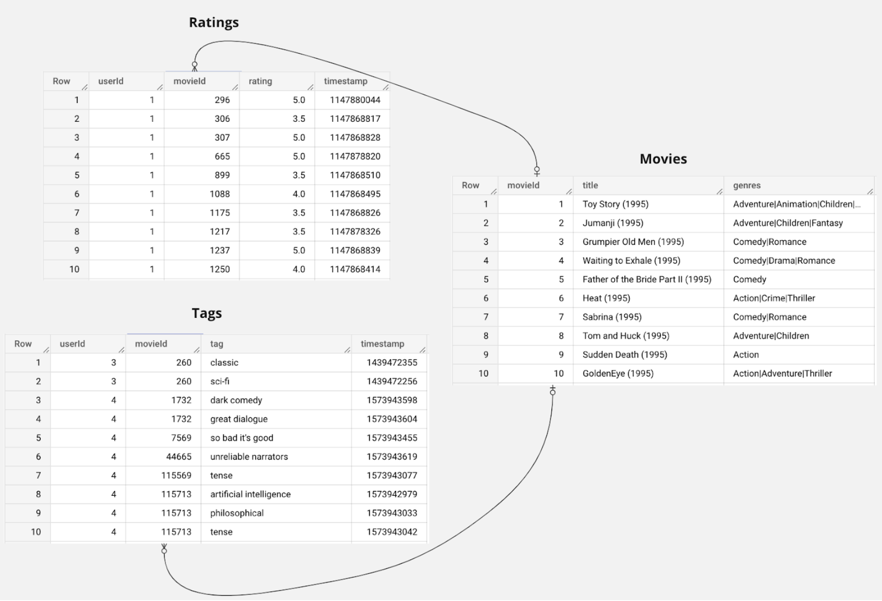
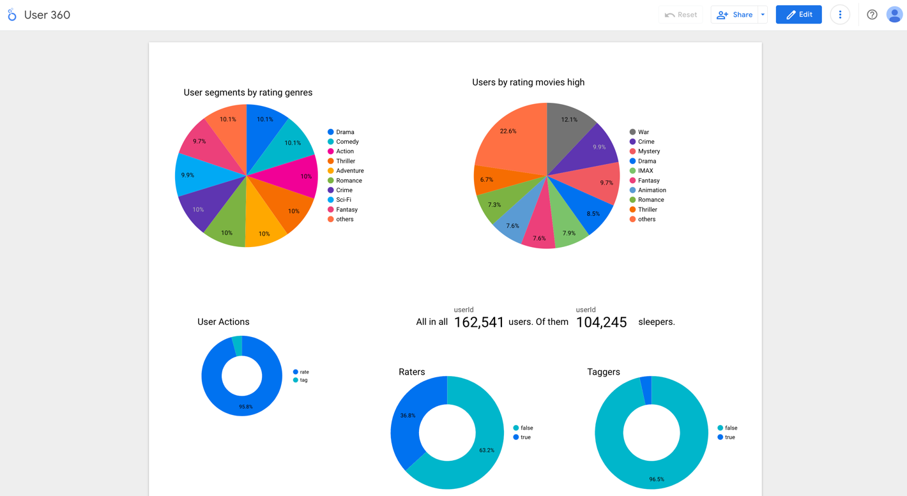
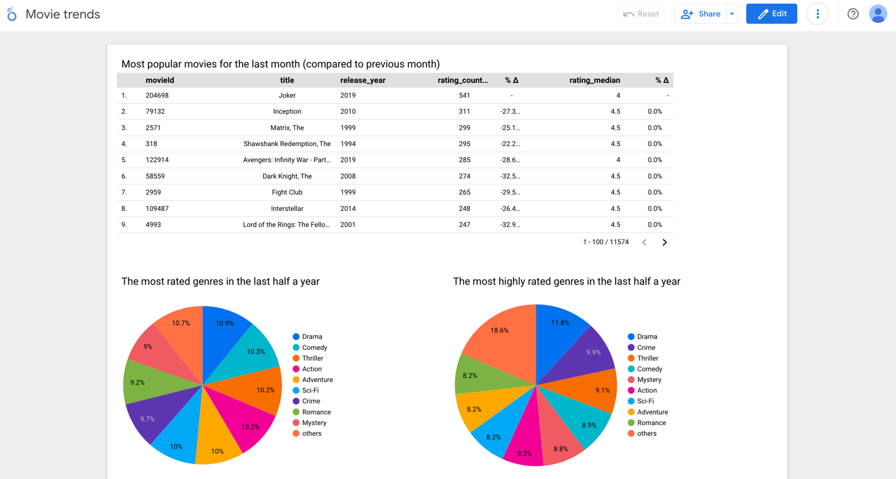
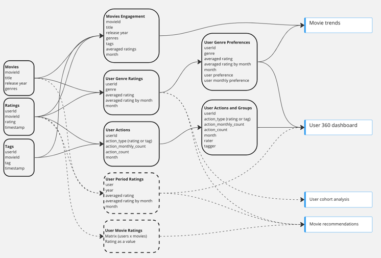
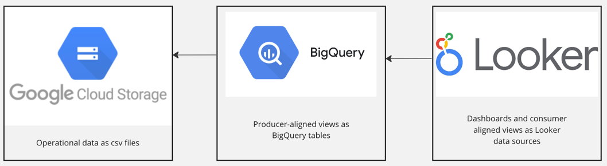

# Dataset analysis
Goal: provide movie studios with more valuable insights about customers.
Input:
* movies.csv (movieId, title, genres)
* ratings.csv (userId, movieId, rating, timestamp)
* tags.csv (userId, movieId, tag, timestamp)

Deliverables include:
1. 2 working dashboards in Looker Studio with insights from the data
   * User 360
   * Movie trends
2. Data model schema
3. Architecture diagram 
4. 3 producer-aligned data views in BigQuery
5. 2 consumer-aligned datasets in Looker Studio

## User 360
Note: The data does not include movie studio IDs, so the author could not make the views personalized for movie studios. 
Instead, the insights characterize the entire audience of Blockbuster.com.

The goal of this dashboard is to provide segmentation of users by interests and behavior on the platform.
The assumption is that this dashboard will be used for marketing at movie studios for mapping the audience
and running marketing campaigns.

Finds:
1. The first 2 charts show the segments that can be created for movie genres preferences.
   1. We can see that people gave nearly the same amount of ratings to the first 9 most popular genres.
   2. However `War`, `Crime`, and `Mystery` are more frequently rated highly than other genres.
2. The next 3 charts show segments from user behavior point of view.
   1. We can see that people rate movies much more frequently than they tag them. We might consider tag as a strong 
   action, showing that a user plans to return to the movie. It also can be that some people just like to tag
   all the movies they watch.
   2. We can break the audience in 3 groups according to a heuristic:
      1. Raters (> 100 rates)
      2. Taggers (> 7 tags)
      3. Sleepers (all the rest)
   
      We might want to engage the `sleepers` more with a promise of personal recommendations.

With more investment it would be interesting to explore:
1. Interests in certain periods of movies (e.g. 80s, 90s, only new movies)
2. Tags that can be considered "interests"
3. Tags that have a sentimental value
4. How everything changes with time
5. How behavior of different cohorts changes over time, looking for any feature that can help us predict the churn.
The author recommends creating a different dashboard for the last point, since it has a different goal and will change
for different reason.

## Movie trends
Note: The data doesn't include movie studio IDs, so the author couldn't make the views personalized for movie studios. 
Instead, the insights characterize the whole audience of Blockbuster.com.

The goal of this dashboard is to assess content engagement. The assumption is that this dashboard will be used by 
content creators at movie studios for assessing the current engagement of company's movies and for making 
decisions on creating and releasing new content.

Finds:
1. The table on top shows the ranking of movies from the most often rated to least often rated.
   It also includes release year, average rating for the movie, and comparison of the average 
   rating for the last month with the previous month. (The chart is supposed to have a sliding time window,
   but the data is stale, so it was not possible to implement.)
   1. We can see that the most often rated movies in the last month are a mix of older movies and the new movies
   but the old movies prevail. Nov 2019 is the last month available in the data, thus movies from 2019 are considered 
   to be new. The dominance of the old movies seems a little counter-intuitive, the author would expect new 
   movies to prevail. According to the data description, all users selected for the dataset left at least 20 ratings. 
   That means that the table characterizes the behavior of frequent users of the platform, it is not people who 
   came from the search to watch one movie. It would be interesting to explore.
   2. The chat helps to understand what kind of movies can make it to the top, and how these movies take the attention
   of users away from the older movies.
   3. We can also see that the average rating of the top movies didn't change in a month for the top movies. It'd be
   interesting to explore the variance of ratings and how the median rating changes over the time.
2. Two other pie charts reflect trending genres in the last half a year. 
   1. We can see that `Drama`, `Comedy`, and `Thriller` are the most often rated genres, but the largest number 
   of high ratings received `Drama`, `Crime`, and `Thriller`. It looks like in the last half a year there is an 
   unsatisfied demand for good comedies. This insight can help content creators define the release data for the
   content.
   2. It might look like `movie genres preferences` chart in `user 360` dashboard is the same, 
   and they should be a part of one dashboard. The author would argue though that they are used differently, and 
   have different reason to change. The fact that they look similarly is a mere coincidence, and they should 
   stay separated.

With more investment, it would be interesting to explore:
1. Movie popularity trends to see how long a movie can be trending. It can help with planning of revenue per movie.
2. Genre popularity trends. It can help to make better decisions on creation and releasing of the content.

## Data model schema
The following data model was created to power the dashboards.

The diagram includes data lineage but also the indication which dataset is going to be used for each dashboard.

The idea for data model was inspired by [Data Mesh](https://www.datamesh-architecture.com/) approach that allows
to build a decentralized data architecture by leveraging domain-oriented design and theory of team topologies. 
Input data model was considered to be a normalized operational model that is not analytics friendly. 
To adjust the schema for analytics use-cases the author created 3 denormalized data producer-aligned views 
of the operational model. These are `Movies Engagement`, `User Genre Ratings`, and `User Actions`. 
The author foresees that `User Period Ratings` and `User Movie Ratings` might be useful for building 
other data products in the future.

In the original approach, creation of producer-aligned views would be managed by the domain-oriented cross-functional
team that owns the operational models. Producer-aligned views are a way to establish robust contract that prevents 
the changes in operational model from being realized as broken analytics software. The domain ownership of 
the producer-aligned views allows to fix the problem of "dirty" and "complex" data at the source and 
caters for scalability of analytics.

In order to separate concerns of data producers from concerns of data consumers, 2 consumer-aligned views are created
`User Genre Preferences` and `User Actions and Groups`. Both views add interpretation to the data. This additional logic
is supposed to be owned by a consumer group and might or might not be relevant for other groups of consumers.

## Architecture diagram

As mentioned the choice of technology was largely defined by the infrastructure that Funda uses internally.
Other consideration were
* The input data is clean and structured as tables. It allows for simple use of SQL for the analysis, no need 
for imperative style transformations.
* Low price. Low code configuration via the console allowed for building prototype fast. At the expected usage, no costs
for infrastructure are expected.
* BigQuery utilized massive parallelism which is important for processing of the large volumes of data.
Although 700 MB data didn't give much food for concerns either way.
* Security out of the box with GCP managed integrations, encryption, etc.
* Target architecture naturally supports Data Mesh approach that is mentioned above and allows different types
of users work with the different types of programs, friendly and familiar for them, as is BigQuery for heavy engineering
tasks and Looker Studio for BI related.

Possible improvements:
* infrastructure as code
* dbt to manage the views
* splittable file format, like Parquet or Avro

## Producer-aligned views

As mentioned in the Architecture diagram, producer-aligned views are created and maintained in BigQuery.
The SQL queries can be found in [movies interactions domain](movies_interactions_domain).

Possible improvements:
* DTAP (Development, Testing, Acceptance, Production) environments
* CI/CD with linters, tests, etc

## Consumer-aligned views
As mentioned in the Architecture diagram, consumer-aligned views are created and maintained in Looker Studio.

The views are configured manually. Additional columns with inferences are implemented as data source calculated fields, 
that can be found in [movies engagement domain](movies_engagement_domain).

## Six theoretical questions
Check out [six theoretical questions](QUESTIONS_README.md).
